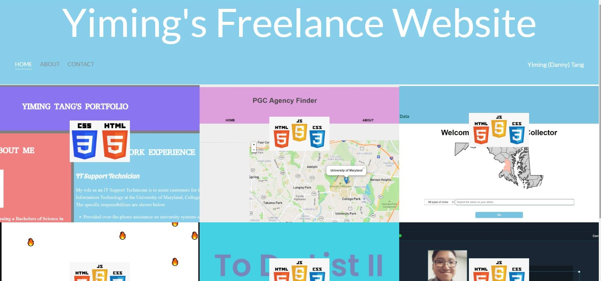
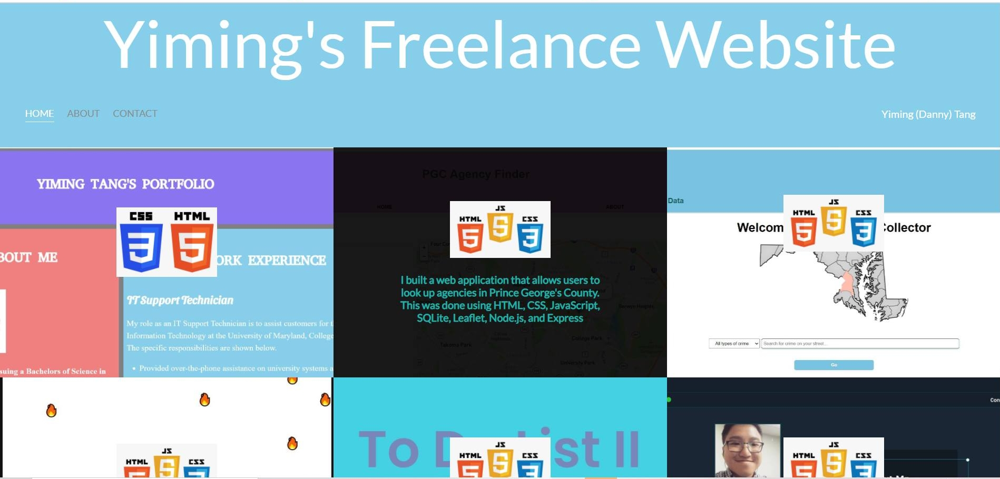
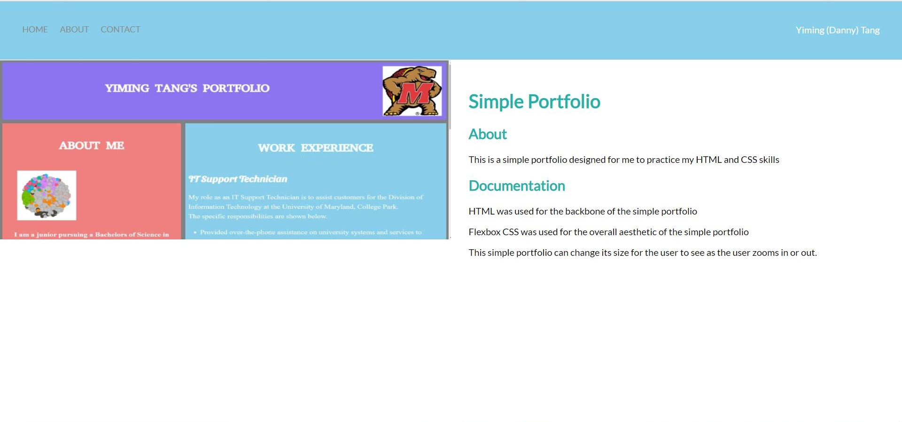
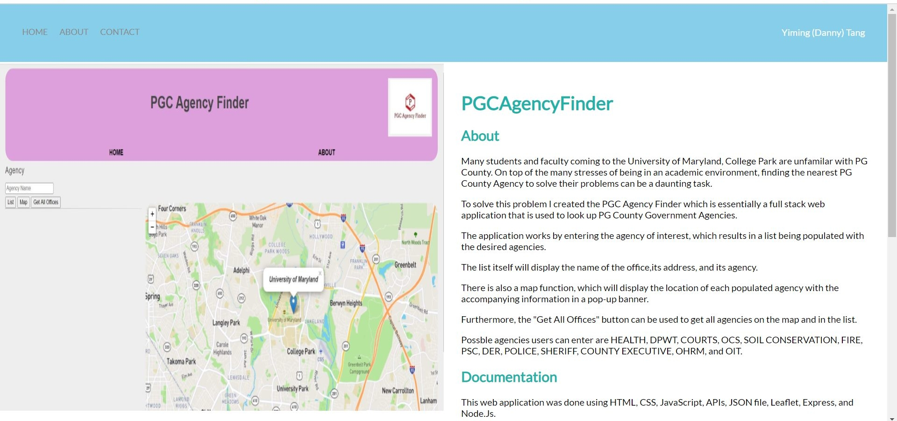
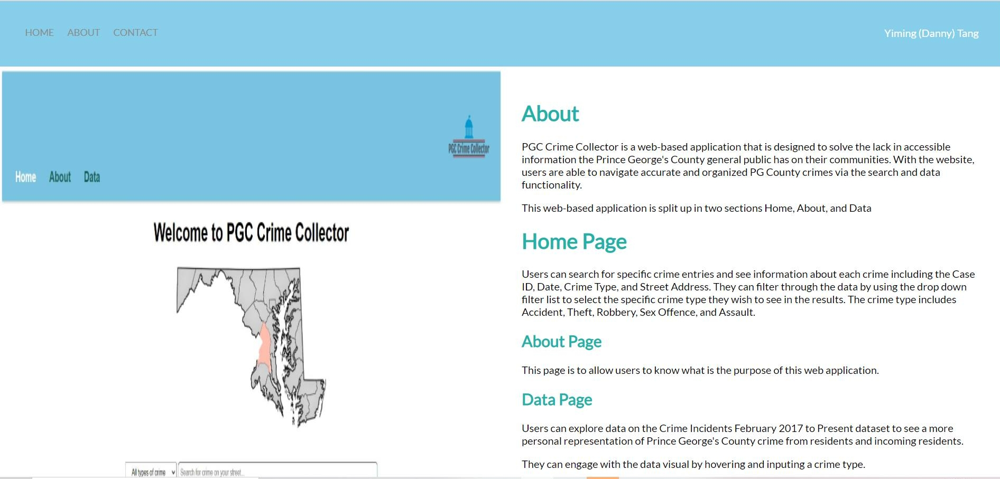
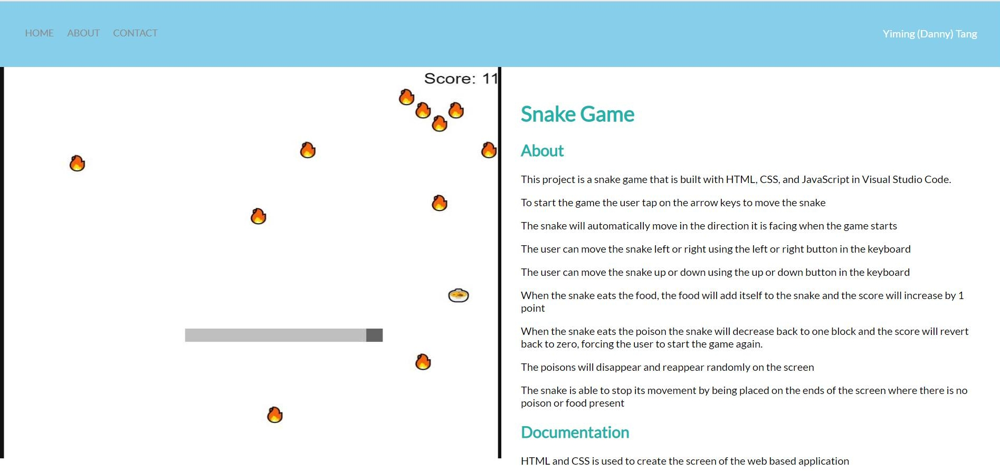
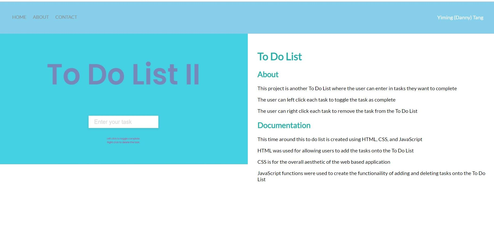
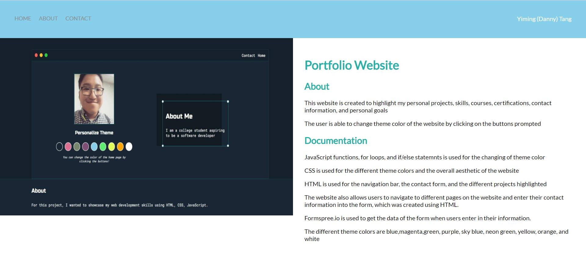
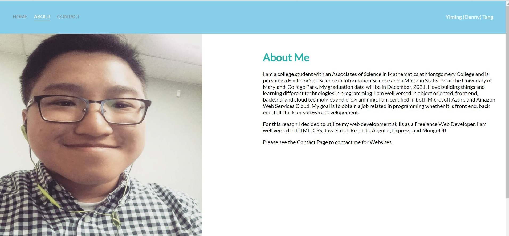
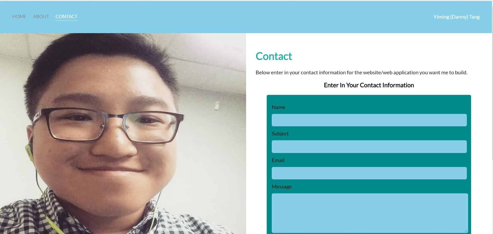

# Freelance Website
 
# About
This project is a blog website where it  I built and the services I offer

# Documentation

HTML was used for the backbone of the page, the navigation bars, and the contact form

CSS was used for the aesthetic of the website

JavaScript was used to blur out the background image when the user hovers on it in the home page.
                      
Formspree.io is used for the backend of the contact form

This website was deployed on Heroku
## https://yiming-tang-freelance.herokuapp.com/

# Result when the user opens the website

# Result when the user hovers over a background image

# Result when the user is on Simple Portfolio
                    
# Result when the user is on PGCAgencyFinder
                       
# Result when the user is on PGC Crime Collector
                       
# Result when the user is on Snake Game
                        
# Result when the user is on To Do List
                      
# Result when the user is on Portfolio Website
                        
# Result when the user is on the about page

# Result when the user is on the contact page
                        
                      
                     
                        
                       
                            
                  
